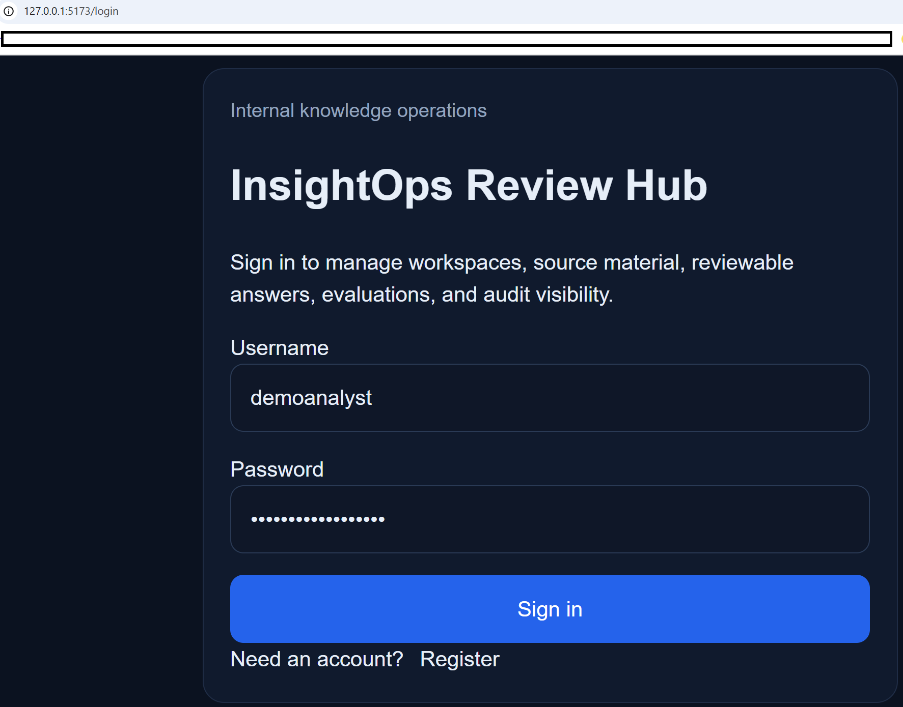
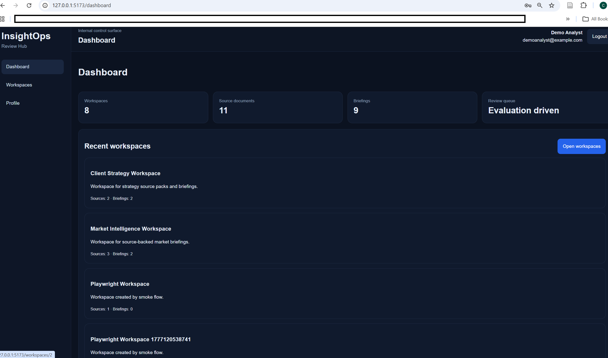
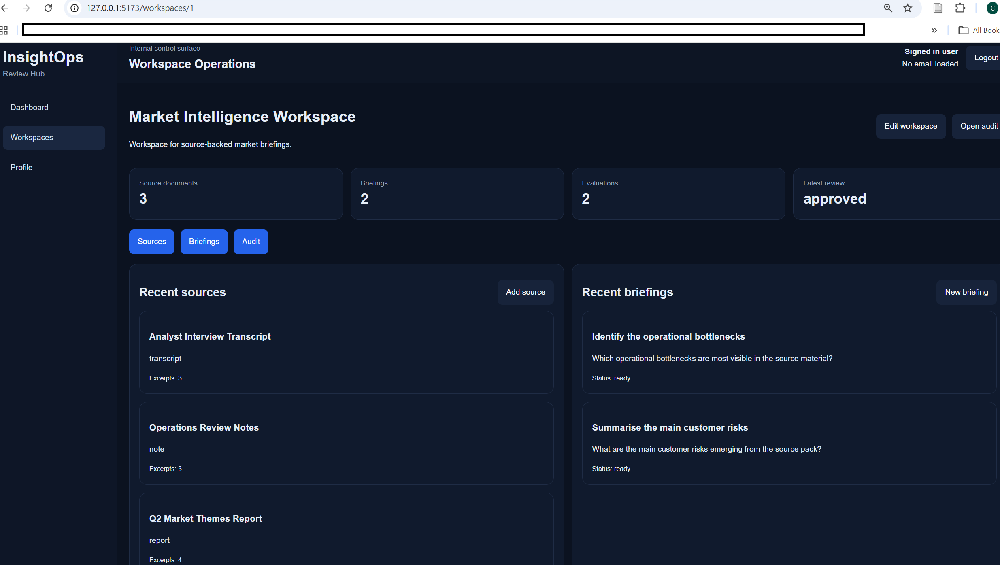
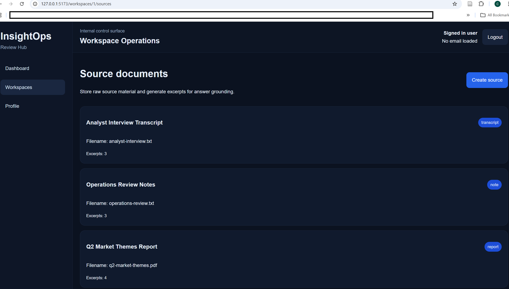
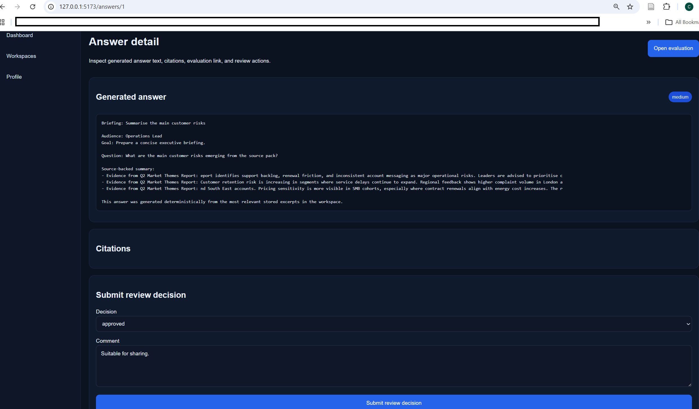
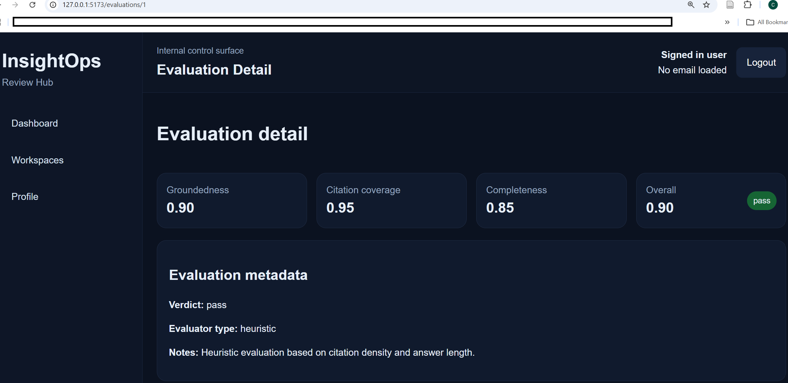
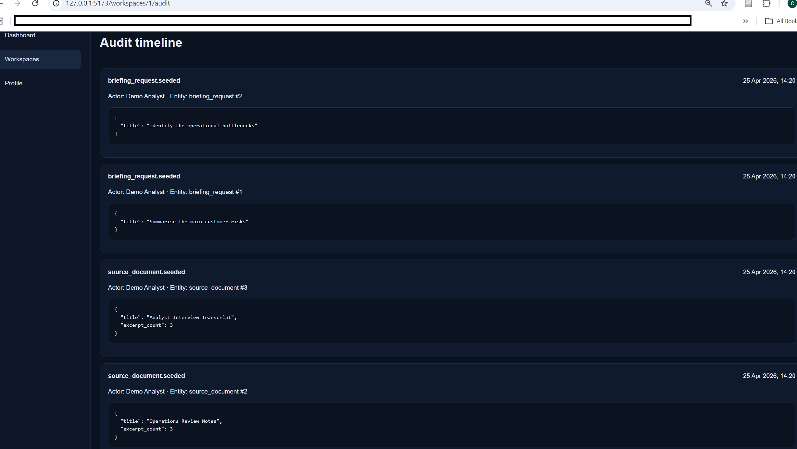
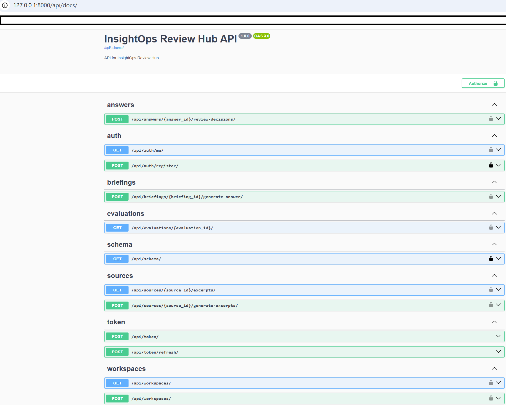
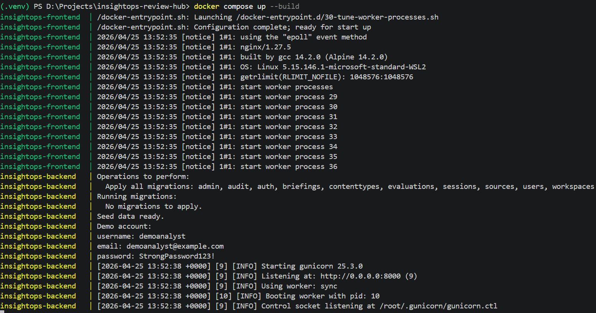
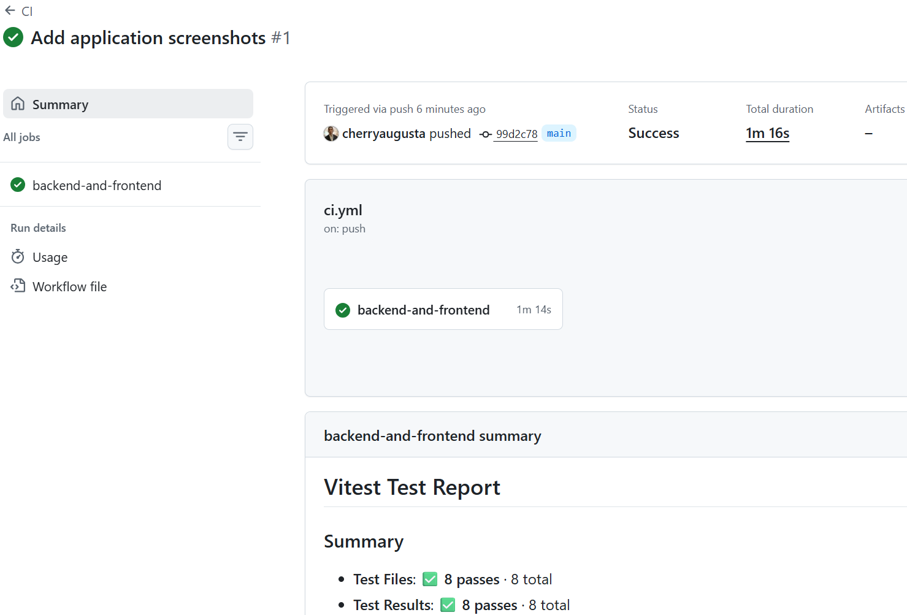

# InsightOps Review Hub

InsightOps Review Hub is a full-stack knowledge operations application that turns private source material into reviewable, citation-backed briefing answers with evaluation and audit visibility.

It combines a documented Django REST Framework backend, a typed React and TypeScript frontend, deterministic source-backed answer generation, persisted evaluation scorecards, human review decisions, audit visibility, Dockerized PostgreSQL support, and CI validation.

## Repository purpose

This repository demonstrates a production-minded internal product that is designed to be reviewable both as software and as an operational workflow.

It exists to show:

- full-stack delivery with Django, DRF, React, and TypeScript
- owner-scoped access control through workspace ownership
- deterministic answer generation without external API keys
- normalized relational modeling for citations
- persisted automated evaluation separated from human review
- audit visibility across core workflow actions
- typed frontend-backend integration
- reproducible local and Docker-based setup
- backend, frontend, and browser-level testing
- GitHub Actions CI

## Product positioning

InsightOps Review Hub is an internal knowledge operations control surface for analysts, consultants, research teams, and operations users who need to turn private source material into reviewable briefing outputs without losing evidence traceability.

The product is intentionally built around reviewability rather than opaque automation. Source material is stored explicitly, excerpts are generated deterministically, answers are grounded in stored excerpts, citations remain visible, evaluation runs are persisted, review decisions are captured independently, and audit history remains inspectable.

## Core workflow

1. Create a workspace  
2. Add source documents  
3. Generate excerpts from source text  
4. Create a briefing request  
5. Generate a citation-backed answer  
6. Persist an evaluation run  
7. Submit a human review decision  
8. Inspect the audit timeline  

## Key features

- custom Django user model created before first migration
- JWT-authenticated API
- workspace CRUD
- source document CRUD
- deterministic excerpt generation
- deterministic citation-backed answer generation
- normalized `AnswerCitation` rows
- persisted `EvaluationRun` records
- persisted `ReviewDecision` records
- append-only audit events
- owner-scoped access control through workspace ownership
- OpenAPI schema and Swagger UI
- typed React frontend
- SQLite-first local development
- PostgreSQL-ready Docker Compose setup
- backend, frontend, and smoke tests
- GitHub Actions CI

## Application preview

All screenshots below must correspond to real persisted application state and must be stored in `docs/screenshots/`.

### Login page

Route: `/login`



### Dashboard overview

Route: `/dashboard`



### Workspace detail

Route: `/workspaces/:workspaceId`



### Source documents list

Route: `/workspaces/:workspaceId/sources`



### Briefing answer with citations

Route: `/answers/:answerId`



### Evaluation scorecard

Route: `/evaluations/:evaluationId`



### Audit timeline

Route: `/workspaces/:workspaceId/audit`



### OpenAPI docs

Route: `http://127.0.0.1:8000/api/docs/`



### Docker running services

Screen: Docker Compose terminal output



### GitHub Actions passing

Screen: GitHub Actions workflow run



## Architecture

### Backend apps

- `apps/users`
  - custom user model
  - identity and profile support

- `apps/workspaces`
  - workspace ownership
  - workspace lifecycle and metadata

- `apps/sources`
  - source documents
  - source excerpts
  - excerpt generation flow

- `apps/briefings`
  - briefing requests
  - generated answers
  - normalized answer citations

- `apps/evaluations`
  - evaluation runs
  - review decisions

- `apps/audit`
  - append-only audit events

- `apps/api`
  - serializers
  - permissions
  - selectors
  - services
  - views
  - urls

### Frontend modules

- `app/`
- `components/layout/`
- `components/ui/`
- `features/auth/`
- `features/dashboard/`
- `features/workspaces/`
- `features/sources/`
- `features/briefings/`
- `features/evaluations/`
- `features/audit/`
- `lib/`
- `styles/`

## Technology stack

### Backend

- Python
- Django
- Django REST Framework
- djangorestframework-simplejwt
- drf-spectacular
- WhiteNoise
- SQLite
- PostgreSQL
- pytest

### Frontend

- React
- TypeScript
- Vite
- React Router
- TanStack Query
- Zustand
- Zod
- Axios
- Vitest
- Playwright

### Delivery

- Docker Compose
- GitHub Actions

## Local setup on Windows PowerShell

### 1. Move to the repository root

```powershell
Set-Location D:\Projects\insightops-review-hub
````

### 2. Activate the virtual environment

```powershell
.\.venv\Scripts\Activate.ps1
```

If PowerShell blocks activation:

```powershell
Set-ExecutionPolicy -Scope Process -ExecutionPolicy Bypass
.\.venv\Scripts\Activate.ps1
```

### 3. Install backend dependencies

```powershell
pip install -r backend\requirements.txt
```

### 4. Install frontend dependencies

```powershell
Set-Location D:\Projects\insightops-review-hub\frontend
npm install
```

### 5. Return to the repository root and ensure `.env` exists

```powershell
Set-Location D:\Projects\insightops-review-hub
Copy-Item .env.example .env -Force
```

### 6. Run backend locally with SQLite

```powershell
Set-Location D:\Projects\insightops-review-hub\backend
python manage.py makemigrations
python manage.py migrate
python manage.py seed_demo_data
python manage.py runserver
```

`python manage.py runserver` is long-running.
When finished, press `CTRL + C`.

### 7. Run frontend locally in a second terminal

```powershell
Set-Location D:\Projects\insightops-review-hub\frontend
npm run dev
```

`npm run dev` is long-running.
When finished, press `CTRL + C`.

## Docker setup

Run from the repository root:

```powershell
Set-Location D:\Projects\insightops-review-hub
docker compose up --build
```

This command is long-running.
When finished, press `CTRL + C`, then run:

```powershell
docker compose down
```

## Demo account

* username: `demoanalyst`
* email: `demoanalyst@example.com`
* password: `StrongPassword123!`

## API surface

### Auth

* `POST /api/auth/register/`
* `POST /api/token/`
* `POST /api/token/refresh/`
* `GET /api/auth/me/`

### Workspaces

* `GET /api/workspaces/`
* `POST /api/workspaces/`
* `GET /api/workspaces/<id>/`
* `PATCH /api/workspaces/<id>/`
* `DELETE /api/workspaces/<id>/`

### Sources

* `GET /api/workspaces/<workspace_id>/sources/`
* `POST /api/workspaces/<workspace_id>/sources/`
* `GET /api/workspaces/<workspace_id>/sources/<id>/`
* `PATCH /api/workspaces/<workspace_id>/sources/<id>/`
* `DELETE /api/workspaces/<workspace_id>/sources/<id>/`
* `POST /api/sources/<id>/generate-excerpts/`
* `GET /api/sources/<id>/excerpts/`

### Briefings

* `GET /api/workspaces/<workspace_id>/briefings/`
* `POST /api/workspaces/<workspace_id>/briefings/`
* `GET /api/workspaces/<workspace_id>/briefings/<id>/`
* `PATCH /api/workspaces/<workspace_id>/briefings/<id>/`
* `DELETE /api/workspaces/<workspace_id>/briefings/<id>/`
* `POST /api/briefings/<id>/generate-answer/`

### Answers, evaluations, reviews

* `POST /api/answers/<id>/review-decisions/`
* `GET /api/evaluations/<id>/`

### Audit

* `GET /api/workspaces/<workspace_id>/audit-events/`

### Docs

* `GET /api/schema/`
* `GET /api/docs/`

## Testing

### Backend

```powershell
Set-Location D:\Projects\insightops-review-hub\backend
python manage.py check
python manage.py test
pytest
```

### Frontend

```powershell
Set-Location D:\Projects\insightops-review-hub\frontend
npm run test -- --run
npm run build
```

### Browser smoke flow

```powershell
Set-Location D:\Projects\insightops-review-hub\frontend
npx playwright install
npx playwright test
```

## Repository structure

```text
insightops-review-hub/
├── .env
├── .env.example
├── .gitignore
├── README.md
├── LICENSE
├── Dockerfile.backend
├── Dockerfile.frontend
├── docker-compose.yml
├── backend/
│   ├── manage.py
│   ├── requirements.txt
│   ├── pytest.ini
│   ├── config/
│   └── apps/
│       ├── users/
│       ├── workspaces/
│       ├── sources/
│       ├── briefings/
│       ├── evaluations/
│       ├── audit/
│       └── api/
├── frontend/
│   ├── src/
│   ├── tests/
│   ├── package.json
│   ├── vite.config.ts
│   └── playwright.config.ts
├── docs/
│   ├── case-study/
│   └── screenshots/
└── .github/
    └── workflows/
```

## Additional documentation

* [Portfolio case study](./docs/case-study/portfolio-case-study.md)

## License

This project is licensed under the [MIT License](./LICENSE).